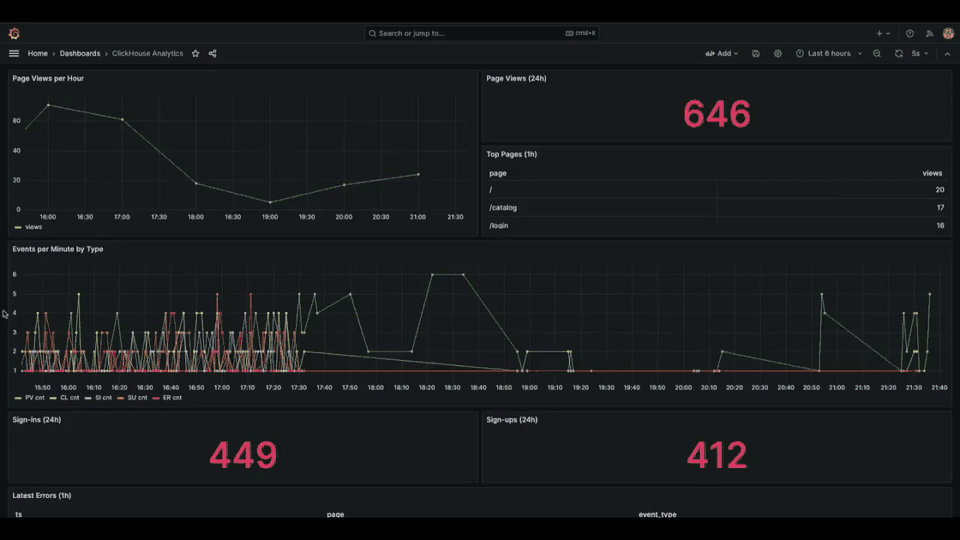

# Marketplace Demo

This is a demo web application for marketplace. The development environment is fully containerized using [Docker](https://www.docker.com/products/docker-desktop/).


## Getting Started

1. **Install dependencies and start the application containers.**

```bash
  make install
```

2. **Run migrations and seed data.**

```bash
  make dbs
```

3. **Start the frontend development server.**

```bash
  yarn dev
```

### Code Quality & Linting

```bash
  make lint
```

### Shell Access

```bash
  make shell
```

### Testing

```bash
  make test
```

## Available Services

- **Application**: [http://localhost:8585](http://localhost:8585)
- **Geo Dashboard**: [http://localhost:8585/geo/dashboard](http://localhost:8585/geo/dashboard) (for sellers)
- **Filament Admin Panel**: [http://localhost:8585/admin](http://localhost:8585/admin)
- **Horizon Dashboard**: [http://localhost:8585/horizon](http://localhost:8585/horizon)
- **Log Viewer**: [http://localhost:8585/log-viewer](http://localhost:8585/log-viewer)
- **Laravel Telescope**: [http://localhost:8585/telescope](http://localhost:8585/telescope)
- **Meilisearch Dashboard**: [http://localhost:7700](http://localhost:7700)
- **Mailpit (Email Client)**: [http://localhost:8025](http://localhost:8025)
- **Grafana Dashboards**: [http://localhost:3000](http://localhost:3000) (user: `test@example.com`, pass: `password`)
- **Prometheus Targets**: [http://localhost:9090](http://localhost:9090)
- **Recommendation Service (Python/FastAPI)**: [http://localhost:8000](http://localhost:8000)
- **NLP Search Preprocessing Service (Python/FastAPI)**: [http://localhost:8001](http://localhost:8001)
- **Image Analysis Service (Python/FastAPI)**: [http://localhost:8002](http://localhost:8002)
- **Geo Collector Service (Python/FastAPI)**: [http://localhost:8003](http://localhost:8003)

### Grafana Dashboard Charts



## Microservices Integration

This project has been enhanced with several Python-based microservices. Communication between services primarily happens asynchronously via Kafka and synchronously via REST APIs.

### 1. Recommendation Service (Python/FastAPI)

- **Purpose**: Provides personalized product recommendations based on user activity.
- **Technologies**: Python, FastAPI, `confluent-kafka-python`, `clickhouse-driver`.
- **How it works**:
    - **Data Ingestion**: Consumes user activity events (page views, clicks, etc.) from the `user_activity` Kafka topic.
    - **Data Storage**: Stores and aggregates user activity data in **ClickHouse** for fast analytical queries.
    - **Recommendation Logic**: Implements a basic recommendation algorithm that suggests recently viewed products by the user and overall popular products (excluding those already viewed).
    - **API Endpoint**: Exposes a REST API endpoint (`GET /recommendations/{user_id}`) that the Laravel application can call to fetch recommendations for a specific user.
- **Usage**: Laravel can make an HTTP GET request to `http://recommendation_service:8000/recommendations/{user_id}` to get a list of recommended product IDs.

### 2. NLP Search Preprocessing Service (Python/FastAPI)

- **Purpose**: Provides a dedicated service for pre-processing search queries, allowing for future expansion into advanced NLP features like spell-checking, synonym expansion, and intent recognition.
- **Technologies**: Python, FastAPI.
- **How it works**:
    - **API Endpoint**: Exposes a REST API endpoint (`POST /preprocess_query`) that accepts a raw search query.
    - **Preprocessing**: Currently performs basic preprocessing (lowercasing, stripping whitespace). This can be extended with more sophisticated NLP techniques.
- **Usage**: Laravel can send a search query to `http://nlp_search_preprocessing:8001/preprocess_query` before passing it to Meilisearch.

### 3. Image Analysis Service (Python/FastAPI)

- **Purpose**: Asynchronously analyzes product images for features like auto-tagging, content moderation, and quality checks.
- **Technologies**: Python, FastAPI, `confluent-kafka-python`, `Pillow`.
- **How it works**:
    - **Event Consumption**: Listens to the `product_image_uploaded` Kafka topic.
    - **Image Processing**: When a new image upload event is received, it simulates downloading the image (in a real scenario, it would fetch the image from storage), performs analysis (e.g., extracts dimensions, format, generates simulated tags), and determines a moderation status.
    - **Result Publishing**: Publishes the analysis results to the `image_analysis_completed` Kafka topic.
- **Usage**:
    - **Laravel**: After a product image is uploaded, Laravel publishes an event to Kafka.
    - **Laravel Consumer**: A dedicated Laravel Kafka consumer (`image_analysis_consumer`) listens to `image_analysis_completed` topic, dispatches a `ProcessImageAnalysisResult` job, which then updates the `Product` model with the analysis data.

### 4. Geo Collector Service (Python/FastAPI)

- **Purpose**: A service designed to collect reviews from various geo-services (like Google, Yelp, etc.).
- **Technologies**: Python, FastAPI, `confluent-kafka-python`.
- **How it works**:
    - **API Endpoint**: Exposes a `POST /collect_reviews` endpoint that accepts review data. In a real-world scenario, this service would contain schedulers to periodically pull data from external APIs.
    - **Sentiment Analysis**: Performs basic sentiment analysis on the review text.
    - **Publishing**: Publishes the enriched review data to the `geo_reviews` Kafka topic.
- **Usage**:
    - **Laravel Consumer**: A dedicated Laravel Kafka consumer (`geo_reviews_consumer`) listens to the `geo_reviews` topic and dispatches a `ProcessGeoReview` job to store the data in the database.

## Asynchronous Processing with Octane & Swoole

This application runs on **Laravel Octane** with **Swoole** server for high-performance asynchronous processing.

### Key Features

- ⚡ **Persistent application state** - Laravel boots once and stays in memory
- 🚀 **Multi-worker architecture** - parallel request handling
- 🔄 **Asynchronous tasks** - non-blocking background operations
- 💾 **Swoole Tables** - shared in-memory storage across workers
- 📡 **WebSockets** - real-time communication via Laravel Reverb

### Swoole Tables - Shared Memory Storage

Swoole Tables provide ultra-fast in-memory storage accessible across all workers.

### Monitoring Octane

```bash
# Check Octane status
docker compose exec app php artisan octane:status

# Reload workers
docker compose exec app php artisan octane:reload

# View Swoole tables
docker compose exec app php artisan tinker
>>> Octane::table('active_users')->count();
```

## Links

- **[Laravel Octane](https://laravel.com/docs/12.x/octane)**: Official Laravel Octane documentation.
- **[Swoole](https://www.swoole.co.uk/)**: Asynchronous PHP extension.
- **[mateusjunges/laravel-kafka](https://laravelkafka.com/docs/v2.9/introduction)**: This package provides a nice way of producing and consuming kafka messages in Laravel projects.
- **[FastAPI](https://fastapi.tiangolo.com/)**: Modern, fast (high-performance), web framework for building APIs with Python 3.7+ based on standard Python type hints.
- **[ClickHouse Driver (Python)](https://github.com/mymarilyn/clickhouse-driver)**: Python driver for ClickHouse.
- **[Confluent Kafka Python](https://docs.confluent.io/platform/current/clients/confluent-kafka-python/html/index.html)**: Confluent's Python client for Apache Kafka.
- **[Visualising Laravel and Horizon metrics using Prometheus and Grafana](https://freek.dev/2507-visualising-laravel-and-horizon-metrics-using-prometheus-and-grafana)**: A step-by-step guide to visualising Laravel and Horizon metrics using Prometheus and Grafana.
- **[Setting up Prometheus and Grafana](https://spatie.be/docs/laravel-prometheus/v1/setting-up-prometheus-and-grafana/self-hostedfana)**: Setting up Prometheus and Grafana.
- **[Filament 4](https://filamentphp.com/docs/4.x/getting-started)**: UI framework for admin panels & apps with Livewire.
- **[Pest 4](https://pestphp.com)**: The elegant PHP testing framework.
