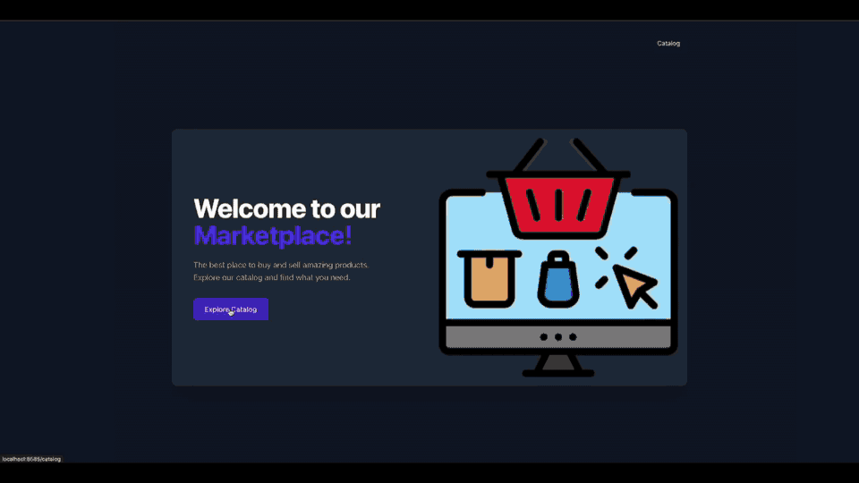

# Marketplace Demo

This is a demo web application for marketplace. The development environment is fully containerized using [Docker](https://www.docker.com/products/docker-desktop/).



## Getting Started

1. **Install dependencies and start the application containers.**

```bash
  make install
```
or
```bash
  make build
  make up
```

2. **Run migrations and seed data.**

```bash
  make migrate
```
or
```bash
  make dbs
```

3. **Start the frontend development server.**

```bash
  yarn dev
```

### Code Quality & Linting

```bash
  make lint
```

### Shell Access

```bash
  make shell
```

### Testing

```bash
  make test
```

## Available Services

- **Application**: [http://localhost:8585](http://localhost:8585)
- **Filament Admin Panel**: [http://localhost:8585/admin](http://localhost:8585/admin)
- **Horizon Dashboard**: [http://localhost:8585/horizon](http://localhost:8585/horizon)
- **Log Viewer**: [http://localhost:8585/log-viewer](http://localhost:8585/log-viewer)
- **Laravel Telescope**: [http://localhost:8585/telescope](http://localhost:8585/telescope)
- **Meilisearch Dashboard**: [http://localhost:7700](http://localhost:7700)
- **Mailpit (Email Client)**: [http://localhost:8025](http://localhost:8025)
- **Grafana Dashboards**: [http://localhost:3000](http://localhost:3000) (user: `test@example.com`, pass: `password`)
- **Prometheus Targets**: [http://localhost:9090](http://localhost:9090)

## Asynchronous Processing with Octane & Swoole

This application runs on **Laravel Octane** with **Swoole** server for high-performance asynchronous processing.

### Key Features

- ⚡ **Persistent application state** - Laravel boots once and stays in memory
- 🚀 **Multi-worker architecture** - parallel request handling
- 🔄 **Asynchronous tasks** - non-blocking background operations
- 💾 **Swoole Tables** - shared in-memory storage across workers
- 📡 **WebSockets** - real-time communication via Laravel Reverb

### Swoole Tables - Shared Memory Storage

Swoole Tables provide ultra-fast in-memory storage accessible across all workers.

### Monitoring Octane

```bash
# Check Octane status
docker compose exec app php artisan octane:status

# Reload workers
docker compose exec app php artisan octane:reload

# View Swoole tables
docker compose exec app php artisan tinker
>>> Octane::table('active_users')->count();
```

## Links

- **[Laravel Octane](https://laravel.com/docs/12.x/octane)**: Official Laravel Octane documentation.
- **[Swoole](https://www.swoole.co.uk/)**: Asynchronous PHP extension.
- **[mateusjunges/laravel-kafka](https://laravelkafka.com/docs/v2.9/introduction)**: This package provides a nice way of producing and consuming kafka messages in Laravel projects.
- **[Visualising Laravel and Horizon metrics using Prometheus and Grafana](https://freek.dev/2507-visualising-laravel-and-horizon-metrics-using-prometheus-and-grafana)**: A step-by-step guide to visualising Laravel and Horizon metrics using Prometheus and Grafana.
- **[Setting up Prometheus and Grafana](https://spatie.be/docs/laravel-prometheus/v1/setting-up-prometheus-and-grafana/self-hostedfana)**: Setting up Prometheus and Grafana.
- **[Filament 4](https://filamentphp.com/docs/4.x/getting-started)**: UI framework for admin panels & apps with Livewire.
- **[Pest 4](https://pestphp.com)**: The elegant PHP testing framework.
